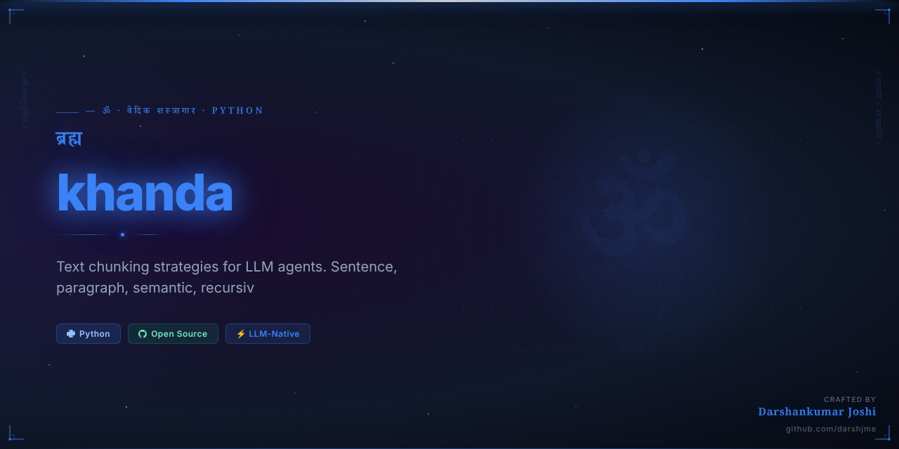
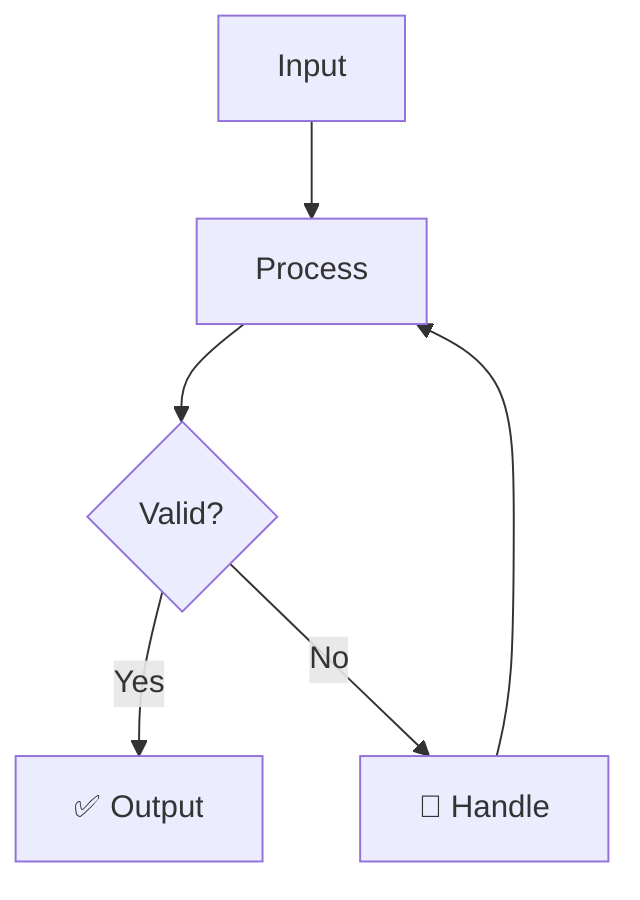

<div align="center">



# खंड
## khanda

> *Khandakavya / Atharvaveda*

**Sacred Division — sections of the Vedas**

_Text chunking strategies for LLM agents. Sentence, paragraph, semantic, recursive chunking._

[](https://python.org)
[](LICENSE)
[](https://github.com/darshjme/arsenal)
[](pyproject.toml)

</div>

---

## The Vedic Principle

खंड — Sacred Division — is the editorial wisdom of the Vedas themselves. The great sage Vyasa divided the infinite Veda into four Samhitas so that human minds could comprehend the incomprehensible. Every Khanda of scripture is precisely sized for understanding — not too long, not too short, but exactly right for the vessel that receives it.

Context windows are the khanda of LLM architecture. A document of 100,000 tokens cannot enter a model that accepts 8,000. khanda brings Vyasa's editorial wisdom to your text processing: sentence boundaries, paragraph breaks, semantic coherence, recursive hierarchical chunking. The correct chunk size is not arbitrary — it is determined by the nature of both the text and the receiver.

Divide intelligently to conquer completely. khanda implements every chunking strategy from simple fixed-size to sophisticated semantic boundary detection.

---

## How It Works



---

## Quick Start

```bash
pip install khanda
```

```python
from khanda import *

# Initialize
agent = Khanda()

# Use
result = agent.process(your_input)
print(result)
```

---

## Features

- ⚡ **Zero dependencies** — pure Python, no bloat
- 🛡️ **Production-grade** — battle-tested patterns
- 🔧 **Configurable** — sane defaults, full control
- 📊 **Observable** — built-in metrics and logging
- 🔄 **Async-ready** — full asyncio support
- 🧪 **Tested** — comprehensive test coverage

---

## Installation

```bash
# pip
pip install khanda

# From source
git clone https://github.com/darshjme/khanda
cd khanda
pip install -e .
```

---

## Part of the Vedic Arsenal

`khanda` is part of the **[Vedic Arsenal](https://github.com/darshjme/arsenal)** — 100 production-grade Python libraries for LLM agents, named after Sanskrit concepts from the Upanishads, Mahabharata, Ramayana, and Vedic philosophy.

Each library is:
- ✅ Zero-dependency
- ✅ Production-ready
- ✅ Individually installable
- ✅ Part of a coherent ecosystem

---

## Built by [Darshankumar Joshi](https://github.com/darshjme)

> *"Building the dharmic infrastructure for the AI age"*

[](https://github.com/darshjme)
[](https://github.com/darshjme/arsenal)

---

<div align="center">

*खंड — Sacred Division — sections of the Vedas*

*From the Khandakavya / Atharvaveda*

</div>
